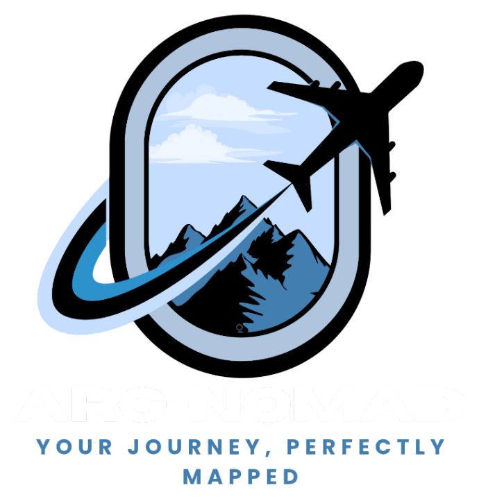

<p align="center">
  
</p>

<!-- Animated System Hero Banner -->
<p align="center">
  
</p>

<p align="center">
  
  
  
  
  
</p>

<p align="center">
  
</p>

ARC-NOMAD is an AI-powered collaborative travel planning and trip-management platform designed for nomad collectives, friends, and expedition crews. Built with Apple-inspired Matte Titanium aesthetics, real-time WebSockets synchronization, and Google Gemini AI itinerary generation.

<p align="center">
  
</p>

## 🌟 Core Flow: Discover → Plan → Collaborate → Travel → Track → Manage → Export

1. **Discover**: Gemini AI Curated Recommendations with category filters, vibes, and 1-click addition to your itinerary.
2. **Plan**: Multi-day itinerary timetables, activity drag-and-drop sequencing, interactive coordinates, and live Open-Meteo weather forecasts.
3. **Collaborate**: Real-time group chat via WebSockets with typing indicators, online member roster, and emoji reactions.
4. **Travel**: Live flight status tracking (Boarding, Departed, Delayed, Cancelled) with automated in-app notifications and real-time cockpit radar.
5. **Track**: Interactive spatial maps plotting all itinerary stops, hotels, and recommendations with category filters and popup cards.
6. **Manage**: Authoritative expense split calculations (Equal, Percentage, Exact) and optimized debt reduction (Minimum Cash Flow Greedy settlement optimizer).
7. **Export**: Executive multi-page ReportLab PDF travel dossier and multi-sheet openpyxl Excel financial workbooks.

<!-- Animated Flight Radar & Telemetry Display -->
<p align="center">
  
</p>

<p align="center">
  
</p>

## 🚀 Architecture & Tech Stack

### Frontend
- **Framework**: Next.js 16 (App Router), React 19, TypeScript
- **Styling & UI**: Tailwind CSS v4, Apple Matte Titanium & Minimalist Ice design system, Frosted Glassmorphism, Micro-animations
- **Visuals & Maps**: Recharts (Interactive category & member spending breakdown charts), Mapbox / OpenStreetMap canvas
- **Icons**: Lucide React

### Backend
- **Framework**: Python FastAPI, Pydantic v2
- **ORM & DB**: SQLAlchemy 2.0 (PostgreSQL & SQLite zero-config compatibility)
- **Real-Time**: WebSockets for trip-scoped group chat
- **AI Engine**: Google Gemini API (`GeminiAIProvider` with `gemini-3.7-flash` via official `google-genai` SDK + `MockAIProvider` fallback)
- **Weather**: Open-Meteo REST API integration with in-memory caching
- **Export Engines**: ReportLab for custom executive PDF dossiers & openpyxl for Excel financial workbooks
- **Testing**: Pytest & automated full-stack verification suites

<p align="center">
  
</p>

## 🔑 Pre-Seeded Demo Accounts (1-Click Login)

For instant exploration and testing, the following Indian explorer accounts are pre-seeded with custom profiles:

| Avatar | Name | Username | Email | Password | Role in Tokyo Trip |
| :---: | :--- | :--- | :--- | :--- | :--- |
|  | **Aarav Sharma** | `alex_nomad` / `aarav_nomad` | `alex@arcnomad.com` | `password123` | **OWNER** |
|  | **Priya Patel** | `sarah_voyage` / `priya_voyage` | `sarah@arcnomad.com` | `password123` | **EDITOR** |
|  | **Kabir Mehta** | `marco_explorer` / `kabir_explorer` | `marco@arcnomad.com` | `password123` | **EDITOR** |
|  | **Ananya Roy** | `elena_wander` / `ananya_roy` | `elena@arcnomad.com` | `password123` | **EXPENSE_MANAGER** |

<p align="center">
  
</p>

## 🛠️ Getting Started

> 📖 **Full Guide**: See [HOW_TO_START.md](file:///d:/projects%20and%20certificates/projects/web/Arc-Nomad/HOW_TO_START.md) for detailed prerequisites, step-by-step setup instructions, troubleshooting, and 1-click launcher scripts (`start.bat`, `start_dev.ps1`).

```cmd
:: Double-click start.bat in the project root, or run via terminal:
start.bat
```
*(Or in PowerShell: `.\start_dev.ps1`)*

This script automatically verifies prerequisites, initializes environment configs (`.env`), seeds demo data (`arc_nomade.db`), and starts both the FastAPI backend (`:8000`) and Next.js frontend (`:3000`) in separate dedicated windows.

### 🛠️ Manual Step-by-Step Setup

#### 1. Backend Setup (FastAPI Python)

```bash
# In project root
python -m venv venv
# On Windows PowerShell:
.\venv\Scripts\Activate.ps1

# Install requirements
pip install -r backend/requirements.txt

# Run database seeder (Optional, seeds demo trips, expenses, flights)
python database/seeds/seed_data.py

# Start FastAPI server
python -m uvicorn backend.app.main:app --host 127.0.0.1 --port 8000 --reload
```

Backend API interactive documentation will be live at: `http://localhost:8000/docs`

### 2. Frontend Setup & Run

```bash
cd frontend
npm install
npm run dev
```

Frontend application will be live at: `http://localhost:3000`

<p align="center">
  
</p>

## 🧪 Testing

```bash
# Run backend unit & integration tests
python -m pytest backend/tests -v

# Run full-stack 12-point end-to-end verification
python backend/tests/verify_full_stack.py
```
